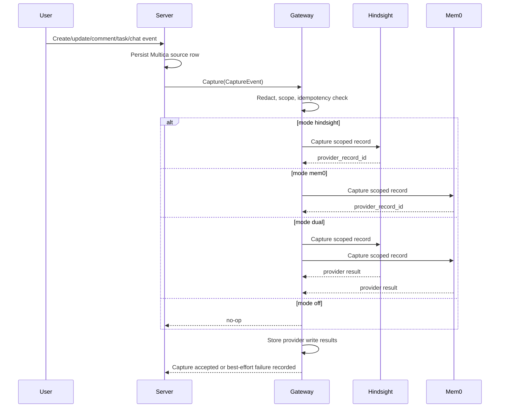
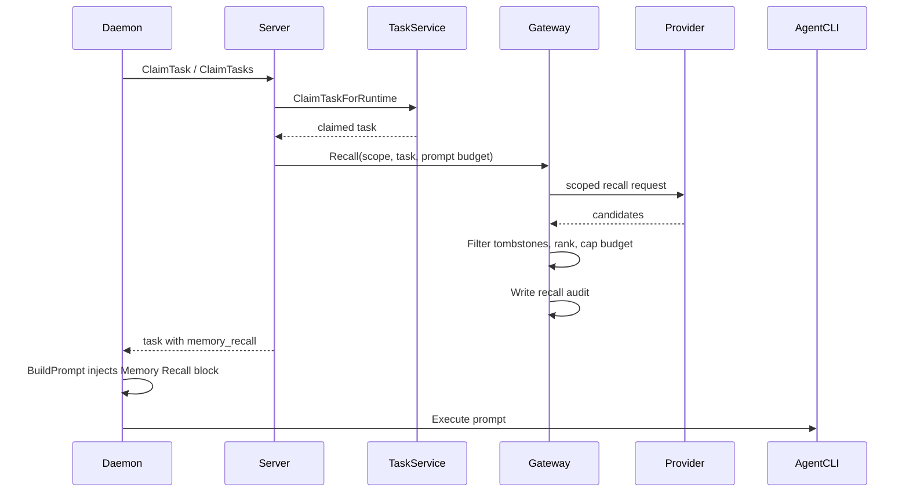
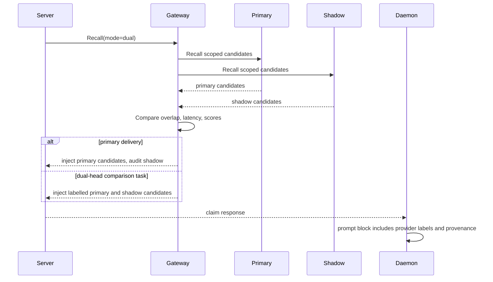

# MultMemory RFC: Provider-Neutral Memory Gateway

> Status: Draft for ROL-61
> Last updated: 2026-07-29
> Target branch: multmemory

## TL;DR

Multica should own long-term agent memory as an auditable product surface, not
delegate it to hidden provider-side memory. The first implementation should add
a server-side memory gateway with provider adapters for Hindsight and mem0 OSS,
strict workspace/project/agent/issue scoping, explicit capture and recall
provenance, feature modes `off`, `hindsight`, `mem0`, and `dual`, and a daemon
claim payload extension that injects recalled memory only through Multica's
existing prompt assembly points.

The current policy remains in force:

- Codex native auto-memory stays disabled by the daemon in
  `server/internal/daemon/execenv/codex_memory.go`.
- Hermes host-configured external `memory.provider` stays disabled in the
  per-task derived config in `server/internal/daemon/execenv/hermes_home.go`.
- Any durable memory exposed to agents must flow through this Multica gateway,
  with user-visible records and deletion/export support.

This RFC is architecture only. It intentionally does not enable memory, create
provider credentials, change prompt defaults, restart daemons, or deploy
production.

## Goals

- Provide one Multica-owned memory gateway contract for Hindsight and mem0 OSS.
- Preserve hard tenant isolation by workspace, then project, then agent, then
  issue.
- Capture only approved sources with auditable event envelopes.
- Recall only scoped memory and inject it with provenance and a strict prompt
  token budget.
- Support a dual-head period where writes go to both providers and reads can
  compare primary versus shadow behavior.
- Preserve the existing hidden-memory disable policy for Codex and Hermes.
- Leave enough schema and rollout detail for follow-up implementation issues.

## Non-Goals

- No production enablement.
- No native Codex or Hermes memory re-enable.
- No model-side "remember this" tools.
- No cross-workspace memory search.
- No private provider-specific objects in prompt text.
- No hard dependency on Hindsight or mem0 being reachable for task execution.

## Current Code Review Notes

The RFC was reviewed against these neighboring code paths:

- Prompt assembly: `server/internal/daemon/prompt.go`:
  `BuildPrompt`, `buildPromptBody`, `buildCommentPrompt`, `buildChatPrompt`,
  `buildAutopilotPrompt`, and `perTurnContextBlocks`.
- Runtime brief assembly: `server/internal/daemon/execenv/runtime_config_sections.go`:
  `buildMetaSkillContentSlim`, `writeProjectContext`,
  `writeWorkflowIssue`, `writeOutput`, and `BuildConnectedAppsBlock`.
- Workdir context files:
  `server/internal/daemon/execenv/context.go`: `writeContextFiles`,
  `renderIssueContext`, `renderQuickCreateContext`, and
  `renderAutopilotContext`.
- Claim payload shape:
  `server/internal/daemon/types.go`: `Task` and related claim-response fields.
- Daemon control plane:
  `server/internal/daemon/client.go`: `ClaimTask`, `ClaimTasks`,
  `ReportTaskMessages`, `CompleteTask`, `FailTask`, and `ReportTaskUsage`.
- Server task lifecycle:
  `server/internal/service/task.go`: enqueue paths, runtime MCP overlay
  storage, `ClaimTaskForRuntime`, `FinalizeTaskClaim`, `CompleteTask`,
  `FailTask`, and `CaptureTaskUsage`.
- Claim response construction:
  `server/internal/handler/daemon.go`: claim response parsing/building,
  including `parseRuntimeConnectedAppsForClaim`.
- Hidden-memory isolation:
  `server/internal/daemon/execenv/codex_memory.go` and
  `server/internal/daemon/execenv/hermes_home.go`.
- Migration conventions:
  `server/migrations`, especially the recent split between hot-table DDL and
  single-statement `CREATE INDEX CONCURRENTLY` migrations.

## Architecture

### Components

1. `memorygateway.Service` in the server owns all capture, recall, deletion,
   export, provider routing, idempotency, feature-mode evaluation, and audit
   writes.
2. Provider adapters implement a small interface for Hindsight and mem0 OSS.
   They receive already-scoped records and must not infer tenant scope from
   provider namespaces alone.
3. The task claim path asks the gateway for scoped recall candidates just before
   the server builds the daemon claim response.
4. The daemon receives a non-secret `memory_recall` payload on the claimed
   `Task` and injects it into prompt text through the existing prompt assembly
   functions.
5. Capture runs after durable Multica events exist: issue/comment/task/chat rows
   are already persisted, and terminal task callbacks already reached the
   server.

### Provider Interface

```go
type Provider interface {
    Name() ProviderName
    Capture(ctx context.Context, event CaptureEvent) (ProviderCaptureResult, error)
    Recall(ctx context.Context, req RecallRequest) (ProviderRecallResult, error)
    Delete(ctx context.Context, req DeleteRequest) error
    Export(ctx context.Context, req ExportRequest) (ProviderExportResult, error)
    Health(ctx context.Context) ProviderHealth
}
```

Provider calls are fully scoped and idempotent:

- `Capture` receives a deterministic `idempotency_key`.
- `Recall` receives an explicit `ScopeSet`; providers never decide scope.
- `Delete` accepts scope tombstones and exact memory ids.
- `Export` streams only one workspace or one narrower scope at a time.

Adapters are best-effort implementation details. They may use provider-native
collections, metadata filters, or namespacing, but the gateway still records the
scope, idempotency key, provider write result, and recall provenance in Multica
tables.

## Scope Model

Every memory record carries these fields:

- `workspace_id` required.
- `project_id` nullable.
- `agent_id` nullable for workspace/project-level facts, required for
  agent-private memory.
- `issue_id` nullable; required for issue-thread and task-run captures.
- `source_type` required.
- `source_id` required when the source is a Multica row.
- `visibility` one of `workspace`, `project`, `agent`, `issue`.

Recall for an issue task may include:

- Same `workspace_id`, same `issue_id`.
- Same `workspace_id`, same `project_id`, project-visible memory.
- Same `workspace_id`, same `agent_id`, agent-visible memory.
- Same `workspace_id`, workspace-visible memory only when explicitly marked
  safe for workspace recall.

Recall for chat tasks follows chat session scope:

- Same workspace.
- Same chat session project, when present.
- Same agent.
- No issue-scoped memory unless the chat task names an issue explicitly and the
  gateway can verify access.

No provider key, collection, embedding namespace, or prompt block may cross the
workspace boundary. A missing scope is a recall miss, not a reason to widen the
query.

## Approved Capture Sources

Initial capture is limited to server-visible, auditable sources:

- Issue description create/update.
- Issue comments and comment edits.
- Final task result comments posted through Multica.
- Task terminal summaries from `CompleteTask` and `FailTask`, after redaction
  and fallback truncation rules.
- Chat messages and agent chat replies.
- Project description and project resource metadata, excluding secrets and raw
  file bodies.
- Issue metadata keys that are explicitly allowed for memory capture.

Excluded by default:

- Raw tool call inputs/outputs.
- Full task transcripts from `task_message`.
- Local file contents.
- Environment variables and custom env.
- Attachments, unless a later issue adds typed extraction and redaction.
- Provider-native hidden memories.

## Capture Event Envelope

All captures pass through a stable gateway envelope:

```json
{
  "event_id": "uuid",
  "idempotency_key": "sha256:...",
  "workspace_id": "uuid",
  "project_id": "uuid-or-null",
  "agent_id": "uuid-or-null",
  "issue_id": "uuid-or-null",
  "source_type": "issue_comment",
  "source_id": "uuid",
  "source_version": "updated_at-or-seq",
  "actor_type": "member|agent|system",
  "actor_id": "uuid-or-null",
  "created_at": "RFC3339",
  "visibility": "issue",
  "content": {
    "text": "redacted canonical text",
    "summary": "optional shorter extract",
    "redaction_policy": "server-redact-v1"
  },
  "metadata": {
    "issue_identifier": "ROL-61",
    "provider_mode": "dual"
  }
}
```

The deterministic idempotency key is:

```text
sha256(
  workspace_id + "\x00" +
  source_type + "\x00" +
  source_id + "\x00" +
  source_version + "\x00" +
  visibility + "\x00" +
  project_id + "\x00" +
  agent_id + "\x00" +
  issue_id
)
```

If the same source version is captured twice, the gateway updates the local
attempt/result rows and must not create duplicate provider memories.

## Recall Provenance

The gateway returns a bounded list of memories with explicit provenance:

```json
{
  "memory_id": "uuid",
  "provider": "hindsight",
  "provider_record_id": "opaque",
  "scope": {
    "workspace_id": "uuid",
    "project_id": "uuid-or-null",
    "agent_id": "uuid-or-null",
    "issue_id": "uuid-or-null",
    "visibility": "issue"
  },
  "source": {
    "source_type": "issue_comment",
    "source_id": "uuid",
    "source_version": "updated_at-or-seq"
  },
  "text": "short recalled memory",
  "score": 0.82,
  "captured_at": "RFC3339",
  "recalled_at": "RFC3339"
}
```

Prompt rendering must show source type, scope label, and provider name. It must
not show provider-private collection names or credentials.

## Prompt Token Budget

Memory recall is a capped, low-priority prompt block:

- Default budget: 1,500 tokens.
- Hard maximum: 3,000 tokens per task unless an issue later raises the product
  limit with tests.
- Per-memory text cap: 220 tokens.
- Minimum provenance overhead is reserved before adding memory text.
- If memory plus provenance exceeds budget, keep highest-scoring memories and
  append a one-line truncation notice with counts.
- The block is omitted entirely when no memory is recalled or feature mode is
  `off`.

Memory must never displace the runtime brief, task mode router, issue/comment
instructions, connected apps, or explicit user content. In `BuildPrompt`, recall
belongs after task-specific user content and before run-scoped context blocks
from `perTurnContextBlocks`, so it is run-scoped and does not mutate the cached
runtime brief prefix.

## Exact Prompt Injection Points

The server-to-daemon contract should add a field to the claim response:

```go
MemoryRecall []MemoryRecallData `json:"memory_recall,omitempty"`
```

Implementation points:

- Add the field to `server/internal/daemon/types.go:Task`.
- Add the matching response field in `server/internal/handler/daemon.go` where
  claimed tasks are serialized for `ClaimTaskByRuntime` and `ClaimTasksByRuntime`.
- Populate it on the server after `TaskService.ClaimTaskForRuntime` selects a
  task and before `FinalizeTaskClaim` commits claim receipt data. If recall
  fails, emit no memory and record an audit/failure row; do not fail claim.
- Render through a new helper in `server/internal/daemon/prompt.go`, called by
  `BuildPrompt` after `buildPromptBody` and before `perTurnContextBlocks`.
- Do not inject volatile recall into
  `server/internal/daemon/execenv/runtime_config_sections.go` because that file
  intentionally keeps per-run state out of the cached runtime brief.
- Optionally write `.agent_context/memory_recall.json` from
  `server/internal/daemon/execenv/context.go:writeContextFiles` for debugging
  and future tools, but prompt text remains the source of model-visible recall.

This mirrors the current pattern for connected apps: `Task.ConnectedApps` is
per-run state and is rendered by `perTurnContextBlocks` through
`BuildConnectedAppsBlock`, not into the stable runtime brief.

## Feature Modes

Feature mode is evaluated by server-side feature flags at capture and recall
time:

- `off`: no provider capture, no provider recall, no prompt block. Existing
  hidden-memory disables remain active.
- `hindsight`: capture and recall only through Hindsight.
- `mem0`: capture and recall only through mem0 OSS.
- `dual`: capture to both providers with one shared idempotency key. Reads use
  a configured primary provider plus optional shadow read from the other
  provider. Shadow recalls are audited and compared but are not injected unless
  the issue asks for dual-head delivery.

The mode is stored on each gateway event/result row so later analysis can
explain which behavior was active when a memory was captured or recalled.

## Failure Semantics

- Capture is asynchronous or post-commit best effort. A provider outage never
  blocks issue/comment/chat/task writes.
- Recall failure does not block task claim. The daemon receives no memory block
  and the task proceeds with existing Multica context.
- Dual writes are independently recorded per provider. One provider failing does
  not roll back the other provider write.
- Provider timeouts use short budgets and bounded retries; the task lifecycle is
  not held hostage by memory.
- Provider records without local audit rows are ignored on recall.
- Local audit rows without provider confirmation remain visible as failed or
  pending capture attempts, not as recalled memories.
- Deletion tombstones win over provider results. A memory marked deleted is
  filtered locally even if a provider still returns it.

## Deletion and Export Contract

Deletion must support:

- Exact memory delete by `memory_id`.
- Scope delete by workspace, project, agent, issue, or source object.
- Provider retry with tombstones until all active providers acknowledge or the
  retention policy expires the retry record.
- Immediate local recall suppression after tombstone creation.

Export must support:

- Workspace export for a workspace owner/admin.
- Narrow export by project, agent, issue, or source.
- Provider, provider record id, scope, source, text, captured timestamps,
  recalled timestamps, and deletion state.
- No secrets or raw provider credentials.

## DB Sketch

Use no new foreign keys for new memory tables. Store UUID references plainly
and enforce integrity in application code and cleanup jobs, matching the recent
no-FK direction on hot/task-adjacent tables.

```sql
CREATE TABLE memory_gateway_event (
    id UUID PRIMARY KEY,
    workspace_id UUID NOT NULL,
    project_id UUID,
    agent_id UUID,
    issue_id UUID,
    source_type TEXT NOT NULL,
    source_id UUID,
    source_version TEXT NOT NULL,
    visibility TEXT NOT NULL,
    idempotency_key TEXT NOT NULL,
    mode TEXT NOT NULL,
    content_sha256 TEXT NOT NULL,
    redaction_policy TEXT NOT NULL,
    actor_type TEXT NOT NULL,
    actor_id UUID,
    created_at TIMESTAMPTZ NOT NULL DEFAULT now(),
    deleted_at TIMESTAMPTZ,
    delete_reason TEXT,
    UNIQUE (workspace_id, idempotency_key)
);

CREATE TABLE memory_provider_write (
    id UUID PRIMARY KEY,
    event_id UUID NOT NULL,
    workspace_id UUID NOT NULL,
    provider TEXT NOT NULL,
    provider_record_id TEXT,
    status TEXT NOT NULL,
    error_code TEXT,
    error_message TEXT,
    attempted_at TIMESTAMPTZ NOT NULL DEFAULT now(),
    completed_at TIMESTAMPTZ,
    UNIQUE (workspace_id, provider, event_id)
);

CREATE TABLE memory_recall_audit (
    id UUID PRIMARY KEY,
    workspace_id UUID NOT NULL,
    task_id UUID,
    chat_session_id UUID,
    issue_id UUID,
    agent_id UUID,
    project_id UUID,
    mode TEXT NOT NULL,
    primary_provider TEXT,
    shadow_provider TEXT,
    prompt_budget_tokens INT NOT NULL,
    injected_tokens INT NOT NULL DEFAULT 0,
    recalled_count INT NOT NULL DEFAULT 0,
    injected_count INT NOT NULL DEFAULT 0,
    created_at TIMESTAMPTZ NOT NULL DEFAULT now()
);

CREATE TABLE memory_recall_audit_item (
    id UUID PRIMARY KEY,
    recall_audit_id UUID NOT NULL,
    workspace_id UUID NOT NULL,
    event_id UUID,
    provider TEXT NOT NULL,
    provider_record_id TEXT,
    score DOUBLE PRECISION,
    injected BOOLEAN NOT NULL DEFAULT false,
    rank INT NOT NULL,
    scope_label TEXT NOT NULL,
    source_type TEXT NOT NULL,
    source_id UUID,
    created_at TIMESTAMPTZ NOT NULL DEFAULT now()
);

CREATE TABLE memory_delete_tombstone (
    id UUID PRIMARY KEY,
    workspace_id UUID NOT NULL,
    project_id UUID,
    agent_id UUID,
    issue_id UUID,
    source_type TEXT,
    source_id UUID,
    memory_event_id UUID,
    reason TEXT NOT NULL,
    created_by_type TEXT NOT NULL,
    created_by_id UUID,
    created_at TIMESTAMPTZ NOT NULL DEFAULT now()
);
```

Indexes on hot tables must be split into their own single-statement migrations
with `CREATE INDEX CONCURRENTLY` / `DROP INDEX CONCURRENTLY`, for example:

```sql
CREATE INDEX CONCURRENTLY IF NOT EXISTS idx_memory_event_workspace_scope
    ON memory_gateway_event (workspace_id, project_id, agent_id, issue_id, created_at DESC);
```

Follow-up migration files should use the next free migration numbers after the
current tree. As of this RFC, the latest migration is `234_llm_usage_cost_backfill`.

## Sequence Diagrams

### Capture



### Recall



### Dual-Head Delivery



## Staged Migration Plan

1. Add gateway types, config, provider interface, and no-op service behind mode
   `off`.
2. Add schema for local event/write/recall/delete audit tables without FKs.
3. Add concurrent indexes in separate single-statement migrations.
4. Wire capture producers for issue comments and task terminal summaries first.
5. Add Hindsight adapter and keep recall disabled.
6. Add mem0 OSS adapter and dual-write idempotency.
7. Add claim-response `memory_recall` and daemon prompt rendering behind `off`.
8. Enable shadow-only recall for internal workspaces.
9. Enable primary read for one provider in a test workspace.
10. Enable dual-head comparison board and benchmark.
11. Produce the ADR using audited comparison data.

## Rollback Plan

- Set feature mode to `off`: stops capture, recall, and prompt injection.
- Keep hidden Codex/Hermes memory disabled.
- Keep local audit tables for forensic export; do not drop data during product
  rollback.
- If a provider adapter misbehaves, disable that provider and continue with
  the other provider or `off`.
- If prompt injection causes task quality issues, keep capture enabled but
  omit `memory_recall` from claim responses.
- Schema rollback in development should drop concurrent indexes first, then
  drop tables in reverse dependency order. Production rollback should prefer
  mode disablement and forward migrations unless a human explicitly approves
  data removal.

## Open Follow-Up Work

- Define exact feature-flag keys and workspace/project override precedence.
- Pick retention defaults for memory events, failed provider writes, and recall
  audits.
- Define the UI boards: Hindsight board, mem0 board, dual-head comparison board,
  delete/export controls.
- Add provider-specific benchmark fixtures and scoring metrics.
- Decide whether `.agent_context/memory_recall.json` is needed in v1 or whether
  prompt-only recall is enough.
